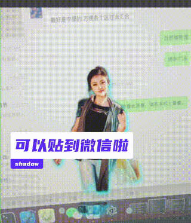

# 参赛作品名
[【隔空取人】【AI创造营】【mixlab】](https://mp.weixin.qq.com/s/UvYNdSBOmSSuCouWZ4MvwQ)

An AR+ML prototype




### 作品简介

手机对准某人，确认要“收集”的他/她，然后对准电脑桌面对某个位置，即可把他/她贴到电脑桌面上！～～～


### 使用方式

1 需要安装nodejs、python的开发环境，还有electron

2 启动服务端
```
cd server
pip install -r requirements.txt
python main.py
```

3 启动客户端
```
cd client
npm i
npm start
```

** 由于新增了自动化库robotjs，需要运行下以下：
```
npm i robotjs
npm i -D electron-rebuild
npm install -g node-gyp
npx electron-rebuild -f -t prod,optional,dev -w robotjs
```

4 首次运行在终端中输入本机密码，生成https证书。

手机跟电脑需在同一个局域网里，手机打开网站
```
   🔒    ❨https❩ Creating server at localhost with locally-trusted certificates.
   📜    ❨auto-encrypt-localhost❩ Local development TLS certificate exists.
   🔒    ❨https❩ Created HTTPS server.
   ✨    ❨auto-encrypt-localhost❩ HTTP server is listening on port 80.
 🚀 🎉 Server running at https://192.168.1.3
```

### TODO
- 尝试让图片动起来~

### 感谢

[百度飞桨官方](https://www.paddlepaddle.org.cn)
```
#人脸检测
hub install pyramidbox_lite_server_mask==1.3.1
#人像分割模型
hub install humanseg_server==1.2.1
```

[ar-cutpaste提供的灵感](https://github.com/cyrildiagne/ar-cutpaste)

